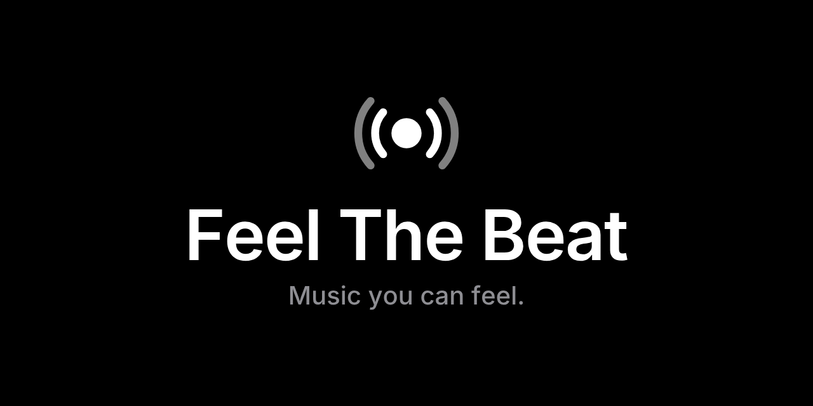
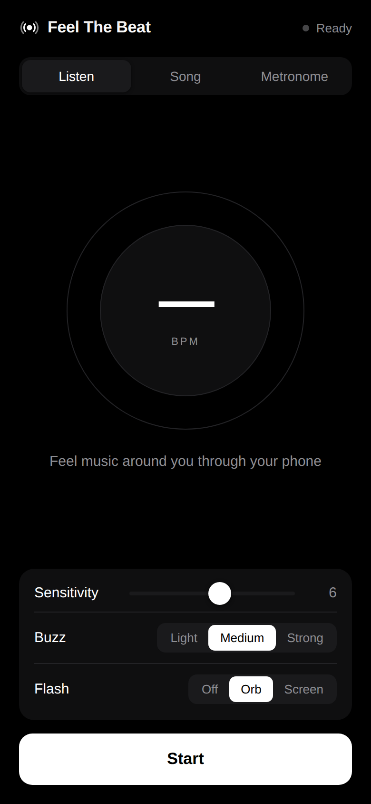
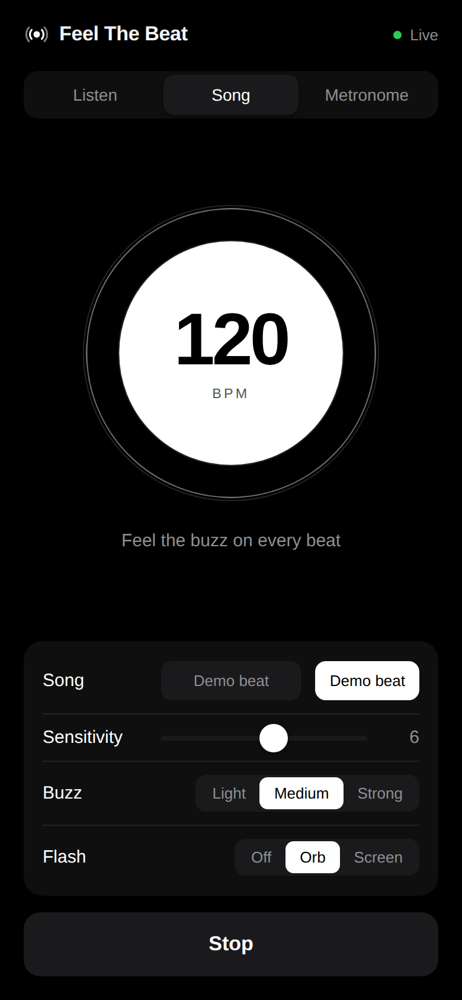
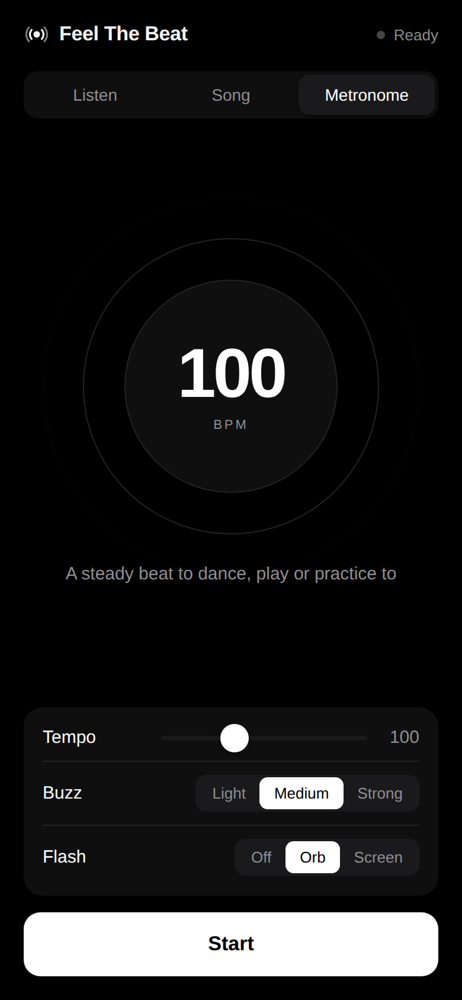
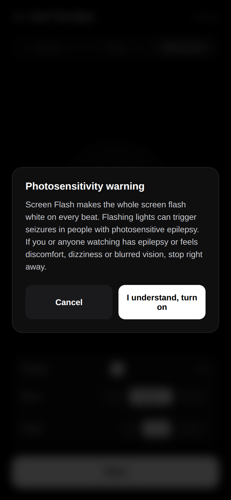

<p align="center">
  
</p>

<h1 align="center">Feel The Beat: music for the deaf</h1>

<p align="center">
  <b>Music you can feel.</b><br>
  Feel The Beat turns music into vibration and light, so deaf and hard-of-hearing people can feel every beat.
</p>

<p align="center">
  <a href="https://saintjohn314.github.io/Feel-The-Beat/"><b>▶ Open the app</b></a> ·
  <a href="PRIVACY.md">Privacy</a> ·
  <a href="ROADMAP.md">Roadmap</a> ·
  <a href="STORE_LISTING.md">Press &amp; store copy</a>
</p>

---

## Why

Music is felt as much as it's heard: the kick drum in your chest, the bass through the floor. Feel The Beat puts that feeling in your hand. It listens for the beat and turns each one into a buzz you feel and a pulse you see, in real time.

No account. No ads. Nothing to set up. Open it and press **Start**.

<p align="center">
  
  
  
  
</p>

## Features

| | |
|---|---|
| **Listen** | Uses the microphone to feel music playing around you: at a concert, in the car, at a party. |
| **Song** | Pick a song on your phone, or tap **Demo beat**, and feel it as it plays. |
| **Metronome** | A steady beat from 40–220 BPM, with a stronger buzz on beat 1. Great for dancing, drumming and practice. |
| **Live BPM** | Shows the tempo of what you're feeling. |
| **Buzz strength** | Light, Medium or Strong. |
| **Visual pulse** | A gentle pulse on every beat, with an optional full-screen flash (off by default, behind a photosensitivity warning). |
| **Private by design** | All listening happens on your device. No audio is recorded, stored or sent anywhere. |
| **Works offline** | Once opened, it keeps working without a connection. |

## Get it on your phone

1. Open **https://saintjohn314.github.io/Feel-The-Beat/** on your phone.
2. **iPhone (Safari):** tap Share → **Add to Home Screen**.
   **Android (Chrome):** tap ⋮ → **Install app** / **Add to Home screen**.
3. Launch it from your home screen like any other app.

### Phone support

| | Vibration | Visual pulse | Mic / Song / Metronome |
|---|---|---|---|
| **Android** (Chrome) | ✅ Full vibration | ✅ | ✅ |
| **iPhone** (Safari, iOS 18+) | ⚠️ Light haptic tap* | ✅ | ✅ |

\* Apple doesn't let websites use the vibration motor. The native App Store version (see [Roadmap](ROADMAP.md)) will use full-strength haptics on iPhone.

## How it works

- Audio (from the mic, a song, or the built-in demo) passes through a **low-pass filter at 150 Hz**. That keeps the kick drum and bass, where the beat lives.
- The app tracks bass energy about 60 times a second and compares it to the last second of audio. When the energy jumps above the recent average by an amount set with the **Sensitivity** slider, it counts a beat.
- Each beat triggers a vibration (Android `navigator.vibrate`, or iOS's system haptic) and the visual pulse.
- The BPM is the median of recent beat gaps, so one stray hit doesn't throw it off.

Tested with real music: it locked onto a 90 BPM track within 5 seconds and held it, and it detects the 120 BPM demo beat exactly.

## Safety

**Photosensitivity warning:** Screen Flash mode flashes the whole screen on each beat. Flashing light can trigger seizures in people with photosensitive epilepsy. It's **off by default**, needs you to confirm a warning before it turns on, and is limited to 3 flashes per second.

## Tech

A single-file progressive web app. Plain HTML, CSS and JavaScript using the Web Audio API, with no frameworks and no build step.

```
index.html            the app
manifest.webmanifest  install info (name, icons, colors)
sw.js                 offline support
icons/                app icons
brand/                logos, app icon, banner (SVG + PNG)
screenshots/          app screenshots
```

Run it locally: `python3 -m http.server` in this folder, then open `http://localhost:8000`.

## Roadmap

Native iOS and Android apps for the App Store and Google Play. See [ROADMAP.md](ROADMAP.md).

---

<p align="center">© 2026 John Wood. All rights reserved.</p>
